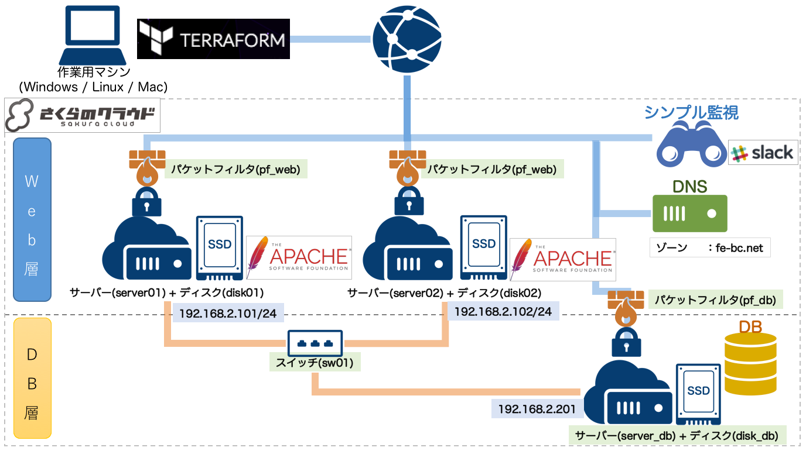

# terraform-for-sakuracloud-start-guide

Qiitaでの連載「[Terraform for さくらのクラウド スタートガイド](http://qiita.com/yamamoto-febc/items/ae92cd258cf040957487)」の
サンプルソースプロジェクトです。

連載の各回に対応するようにタグをつけています。
以下から参照してください。

  - [第1回サンプルコード](https://github.com/yamamoto-febc/terraform-for-sakuracloud-start-guide/tree/no1) / [Qiita連載第1回](http://qiita.com/yamamoto-febc/items/ae92cd258cf040957487)
  - [第2回サンプルコード](https://github.com/yamamoto-febc/terraform-for-sakuracloud-start-guide/tree/no2) / [Qiita連載第2回](http://qiita.com/yamamoto-febc/items/2480b11c9e6a8b64f78d) ([第1回との差分表示](https://github.com/yamamoto-febc/terraform-for-sakuracloud-start-guide/compare/no1...no2))
  - [第3回サンプルコード](https://github.com/yamamoto-febc/terraform-for-sakuracloud-start-guide/tree/no3) / [Qiita連載第3回](http://qiita.com/yamamoto-febc/items/fe954e2d4a92b864cfef) ([第2回との差分表示](https://github.com/yamamoto-febc/terraform-for-sakuracloud-start-guide/compare/no2...no3))
  - [第4回サンプルコード](https://github.com/yamamoto-febc/terraform-for-sakuracloud-start-guide/tree/no4) / [Qiita連載第4回](http://qiita.com/yamamoto-febc/items/a9795cb909bd9b69f729) ([第3回との差分表示](https://github.com/yamamoto-febc/terraform-for-sakuracloud-start-guide/compare/no3...no4))
  - [第5回サンプルコード](https://github.com/yamamoto-febc/terraform-for-sakuracloud-start-guide/tree/no5) / [Qiita連載第5回](http://qiita.com/yamamoto-febc/items/4b774404e041fa05688a) ([第4回との差分表示](https://github.com/yamamoto-febc/terraform-for-sakuracloud-start-guide/compare/no4...no5))

## 第4回

[連載第4回](http://qiita.com/yamamoto-febc/items/a9795cb909bd9b69f729)のサンプルコードです。



## 第4回 : tfファイル

```sakura.tf
/*********************
 * Provider settings
 *********************/
provider "sakuracloud" {
    token = "[ACCESS_TOKEN]"
    secret = "[ACCESS_TOKEN_SECRET]"
}

/*****************
 * Variables
 *****************/
variable "slack_webhook" {
    default = "https://hooks.slack.com/services/X0XXX0XXX/X0XXXXXXX/9XXXOxxxxO8XxxX4XX1xxxxx"
}
variable "mysql_values" {
    default = {
        root_password = "mysql_password"
        user_name = "demo"
        user_password = "demo_password"
    }
}
variable "private_ip_addresses" {
    default = {
        server01 = "192.168.2.101"
        server02 = "192.168.2.102"
        server_db = "192.168.2.201"
    }
}

/*****************
 * Disk
 *****************/
resource "sakuracloud_disk" "disk" {
    name = "${format("disk%02d" , count.index+1)}"
    source_archive_name = "CentOS 7.2 64bit"
    ssh_key_ids = ["${sakuracloud_ssh_key.mykey.id}"]
    disable_pw_auth = true
    count = 2
}
resource "sakuracloud_disk" "disk_db" {
    name = "disk_db"
    source_archive_name = "CentOS 7.2 64bit"
    ssh_key_ids = ["${sakuracloud_ssh_key.dbkey.id}"]
    disable_pw_auth = true
}

/*****************
 * Server
 *****************/
resource "sakuracloud_server" "server" {
    name = "${format("server%02d" , count.index+1)}"
    disks = ["${element(sakuracloud_disk.disk.*.id,count.index)}"]
    additional_interfaces = ["${sakuracloud_switch.sw01.id}"]
    packet_filter_ids = ["${sakuracloud_packet_filter.pf_web.id}"]
    count = 2
    # サーバーにはSSHで接続
    connection {
        user = "root"
        host = "${self.base_nw_ipaddress}"
        private_key = "${file("./id_rsa")}"
    }

    # yumでapache+PHPのインストール
    provisioner "remote-exec" {
        inline = [
            "yum install -y httpd httpd-devel php php-mbstring php-mysqlnd",
            "systemctl restart httpd.service",
            "systemctl enable httpd.service",
            "systemctl stop firewalld.service",
            "systemctl disable firewalld.service"
        ]
    }

    # Webコンテンツをアップロード
    provisioner "file" {
        source = "webapps/"
        destination = "/var/www/html"
    }

    # IP設定スクリプトをアップロード
    provisioner "file" {
        source = "provision_private_ip.sh"
        destination = "/tmp/provision_private_ip.sh"
    }

    # IP設定実行
    provisioner "remote-exec" {
        inline = [
            "chmod +x /tmp/provision_private_ip.sh",
            "/tmp/provision_private_ip.sh ${lookup(var.private_ip_addresses , self.name)}"
        ]
    }


}

resource "sakuracloud_server" "server_db" {
    name = "server_db"
    disks = ["${sakuracloud_disk.disk_db.id}"]
    additional_interfaces = ["${sakuracloud_switch.sw01.id}"]
    packet_filter_ids = ["${sakuracloud_packet_filter.pf_db.id}"]

    # サーバーにはSSHで接続
    connection {
        user = "root"
        host = "${self.base_nw_ipaddress}"
        private_key = "${file("./id_rsa_db")}"
    }

    # yumでmysqlのインストール
    provisioner "remote-exec" {
        inline = [
            "yum install -y mysql-community-server",
            "systemctl start mysql.service",
            "mysql -uroot -e 'GRANT ALL ON *.* TO ${var.mysql_values.user_name}@\"192.168.2.%\" IDENTIFIED BY \"${var.mysql_values.user_password}\"'" ,
            "mysqladmin -u root password '${var.mysql_values.root_password}'",
            "systemctl stop firewalld.service",
            "systemctl disable firewalld.service"
        ]
    }

    # IP設定スクリプトをアップロード
    provisioner "file" {
        source = "provision_private_ip.sh"
        destination = "/tmp/provision_private_ip.sh"
    }

    # IP設定実行
    provisioner "remote-exec" {
        inline = [
            "chmod +x /tmp/provision_private_ip.sh",
            "/tmp/provision_private_ip.sh ${lookup(var.private_ip_addresses , self.name)}"
        ]
    }

}

/*****************
 * SSH key
 *****************/
resource "sakuracloud_ssh_key" "mykey" {
    name = "mykey"
    public_key = "${file("./id_rsa.pub")}"
}

resource "sakuracloud_ssh_key" "dbkey" {
    name = "dbkey"
    public_key = "${file("./id_rsa_db.pub")}"
}

/*****************
 * Switch
 *****************/
resource "sakuracloud_switch" "sw01" {
    name = "sw01"
}

/*****************
 * PacketFilter
 *****************/
resource "sakuracloud_packet_filter" "pf_web" {
    name = "pf_web"
    expressions = {
        protocol = "tcp"
        source_nw = "0.0.0.0/0"
        dest_port = "22"
        description = "Allow SSH"
        allow = true
    }
    expressions = {
        protocol = "tcp"
        source_nw = "0.0.0.0/0"
        dest_port = "80"
        description = "Allow www"
        allow = true
    }
    expressions = {
        protocol = "tcp"
        source_nw = "0.0.0.0/0"
        dest_port = "443"
        description = "Allow www(ssl)"
        allow = true
    }
    expressions = {
        protocol = "tcp"
        source_nw = "0.0.0.0/0"
        dest_port = "32768-61000"
        description = "Allow return packet(tcp)"
        allow = true
    }
    expressions = {
        protocol = "udp"
        source_nw = "0.0.0.0/0"
        dest_port = "32768-61000"
        description = "Allow return packet(udp)"
        allow = true
    }
    expressions = {
        protocol = "icmp"
        source_nw = "0.0.0.0"
        allow = true
        description = "Allow all icmp"
    }
    expressions = {
        protocol = "fragment"
        source_nw = "0.0.0.0"
        allow = true
        description = "Allow all fragment"
    }
    expressions = {
        protocol = "ip"
        source_nw = "0.0.0.0"
        allow = false
        description = "Deny all"
    }
}
resource "sakuracloud_packet_filter" "pf_db" {
    name = "pf_db"
    expressions = {
        protocol = "tcp"
        source_nw = "0.0.0.0/0"
        dest_port = "22"
        description = "Allow SSH"
        allow = true
    }
    expressions = {
        protocol = "tcp"
        source_nw = "0.0.0.0/0"
        dest_port = "32768-61000"
        description = "Allow return packet(tcp)"
        allow = true
    }
    expressions = {
        protocol = "udp"
        source_nw = "0.0.0.0/0"
        dest_port = "32768-61000"
        description = "Allow return packet(udp)"
        allow = true
    }
    expressions = {
        protocol = "icmp"
        source_nw = "0.0.0.0"
        allow = true
        description = "Allow all icmp"
    }
    expressions = {
        protocol = "fragment"
        source_nw = "0.0.0.0"
        allow = true
        description = "Allow all fragment"
    }
    expressions = {
        protocol = "ip"
        source_nw = "0.0.0.0"
        allow = false
        description = "Deny all"
    }
}

/*****************
 * SimpleMonitor
 *****************/

# ping監視(DBサーバー)
resource "sakuracloud_simple_monitor" "ping_monitor_db" {
    target = "${sakuracloud_server.server_db.base_nw_ipaddress}"
    health_check = {
        protocol = "ping"
        delay_loop = 60
    }
    notify_email_enabled = false
    notify_slack_enabled = true
    notify_slack_webhook = "${var.slack_webhook}"
}

# ping監視(webサーバー２台分)
resource "sakuracloud_simple_monitor" "ping_monitor_web" {
    count = 2
    target = "${element(sakuracloud_server.server.*.base_nw_ipaddress , count.index)}"
    health_check = {
        protocol = "ping"
        delay_loop = 60
    }
    notify_email_enabled = false
    notify_slack_enabled = true
    notify_slack_webhook = "${var.slack_webhook}"
}
# web監視(webサーバー2台分)
resource "sakuracloud_simple_monitor" "http_monitor_web" {
    count = 2
    target = "${element(sakuracloud_server.server.*.base_nw_ipaddress , count.index)}"
    health_check = {
        protocol = "http"
        delay_loop = 60
        path = "/index.php"
        status = "200"
    }
    notify_email_enabled = false
    notify_slack_enabled = true
    notify_slack_webhook = "${var.slack_webhook}"
}


/*****************
 * DNS
 *****************/
resource "sakuracloud_dns" "dns" {
    zone = "fe-bc.net"
    records = {
        name = "web"
        type = "A"
        value = "${sakuracloud_server.server.1.base_nw_ipaddress}"
    }
    records = {
        name = "web"
        type = "A"
        value = "${sakuracloud_server.server.0.base_nw_ipaddress}"
    }
}

/*****************
 * Output
 *****************/
output "global_ip" {
    value = "${join("\n" , formatlist("%s : %s" , sakuracloud_server.server.*.name , sakuracloud_server.server.*.base_nw_ipaddress))}"
}
output "global_ip_db" {
    value = "${format("%s : %s\n" , sakuracloud_server.server_db.name , sakuracloud_server.server_db.base_nw_ipaddress)}"
}
output "ssh_web01" {
    value = "${format("ssh root@%s -i %s/id_rsa" , sakuracloud_server.server.0.base_nw_ipaddress , path.root)}"
}
output "ssh_web02" {
    value = "${format("ssh root@%s -i %s/id_rsa" , sakuracloud_server.server.1.base_nw_ipaddress , path.root)}"
}
output "ssh_db" {
    value = "${format("ssh root@%s -i %s/id_rsa_db" , sakuracloud_server.server_db.base_nw_ipaddress , path.root)}"
}
```

## 注意点

SSHキーは各自で生成してください。
以下のコマンドで生成できます。
詳細は記事を参照ください。

```bash:SSHキー生成
$ ssh-keygen -C "" -f ./id_rsa
Generating public/private rsa key pair.
Enter passphrase (empty for no passphrase):  #何も入力せずEnter
Enter same passphrase again:                 #何も入力せずEnter
```