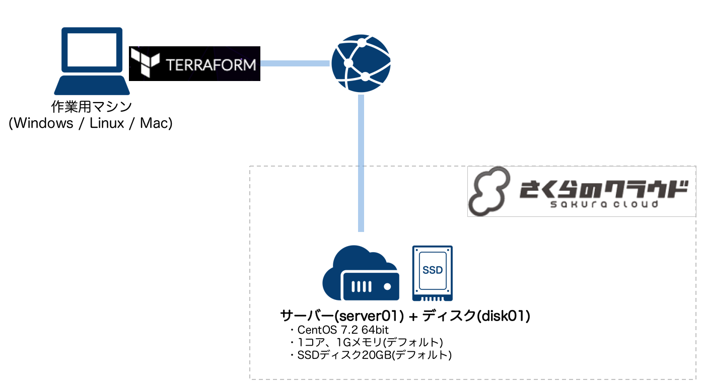

# terraform-for-sakuracloud-start-guide

Qiitaでの連載「[Terraform for さくらのクラウド スタートガイド](http://qiita.com/yamamoto-febc/items/ae92cd258cf040957487)」の
サンプルソースプロジェクトです。

連載の各回に対応するようにタグをつけています。
以下から参照してください。

  - [第1回サンプルコード](https://github.com/yamamoto-febc/terraform-for-sakuracloud-start-guide/tree/no1) / [Qiita連載第1回](http://qiita.com/yamamoto-febc/items/ae92cd258cf040957487)
  - [第2回サンプルコード](https://github.com/yamamoto-febc/terraform-for-sakuracloud-start-guide/tree/no2) / [Qiita連載第2回](http://qiita.com/yamamoto-febc/items/2480b11c9e6a8b64f78d) ([第1回との差分表示](https://github.com/yamamoto-febc/terraform-for-sakuracloud-start-guide/compare/no1...no2))
  - [第3回サンプルコード](https://github.com/yamamoto-febc/terraform-for-sakuracloud-start-guide/tree/no3) / [Qiita連載第3回](http://qiita.com/yamamoto-febc/items/fe954e2d4a92b864cfef) ([第2回との差分表示](https://github.com/yamamoto-febc/terraform-for-sakuracloud-start-guide/compare/no2...no3))
  - [第4回サンプルコード](https://github.com/yamamoto-febc/terraform-for-sakuracloud-start-guide/tree/no4) / [Qiita連載第4回](http://qiita.com/yamamoto-febc/items/a9795cb909bd9b69f729) ([第3回との差分表示](https://github.com/yamamoto-febc/terraform-for-sakuracloud-start-guide/compare/no3...no4))
  - [第5回サンプルコード](https://github.com/yamamoto-febc/terraform-for-sakuracloud-start-guide/tree/no5) / [Qiita連載第5回](http://qiita.com/yamamoto-febc/items/4b774404e041fa05688a) ([第4回との差分表示](https://github.com/yamamoto-febc/terraform-for-sakuracloud-start-guide/compare/no4...no5))

## 第1回

[連載第1回](http://qiita.com/yamamoto-febc/items/ae92cd258cf040957487)のサンプルコードです。



## 第1回 : tfファイル

```sakura.tf
provider "sakuracloud" {
    token = "先ほど取得した[ACCESS_TOKEN]"
    secret = "先ほど取得した[ACCESS_TOKEN_SECRET]"
}

resource "sakuracloud_disk" "disk"{
    name = "disk01"
    source_archive_name = "CentOS 7.2 64bit"
    # 任意のパスワードを設定してください。
    password = "YourPassword"
}

resource "sakuracloud_server" "server" {
    name = "server01"
    disks = ["${sakuracloud_disk.disk.id}"]
}
```

## 注意点

SSHキーは各自で生成してください。
以下のコマンドで生成できます。
詳細は記事を参照ください。

```bash:SSHキー生成
$ ssh-keygen -C "" -f ./id_rsa
Generating public/private rsa key pair.
Enter passphrase (empty for no passphrase):  #何も入力せずEnter
Enter same passphrase again:                 #何も入力せずEnter
```