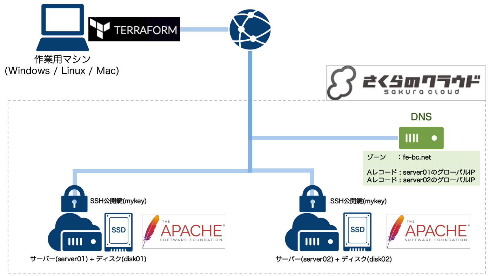

# terraform-for-sakuracloud-start-guide

Qiitaでの連載「[Terraform for さくらのクラウド スタートガイド](http://qiita.com/yamamoto-febc/items/ae92cd258cf040957487)」の
サンプルソースプロジェクトです。

連載の各回に対応するようにタグをつけています。
以下から参照してください。

  - [第1回サンプルコード](https://github.com/yamamoto-febc/terraform-for-sakuracloud-start-guide/tree/no1) / [Qiita連載第1回](http://qiita.com/yamamoto-febc/items/ae92cd258cf040957487)
  - [第2回サンプルコード](https://github.com/yamamoto-febc/terraform-for-sakuracloud-start-guide/tree/no2) / [Qiita連載第2回](http://qiita.com/yamamoto-febc/items/2480b11c9e6a8b64f78d) ([第1回との差分表示](https://github.com/yamamoto-febc/terraform-for-sakuracloud-start-guide/compare/no1...no2))
  - [第3回サンプルコード](https://github.com/yamamoto-febc/terraform-for-sakuracloud-start-guide/tree/no3) / [Qiita連載第3回](http://qiita.com/yamamoto-febc/items/fe954e2d4a92b864cfef) ([第2回との差分表示](https://github.com/yamamoto-febc/terraform-for-sakuracloud-start-guide/compare/no2...no3))
  - [第4回サンプルコード](https://github.com/yamamoto-febc/terraform-for-sakuracloud-start-guide/tree/no4) / [Qiita連載第4回](http://qiita.com/yamamoto-febc/items/a9795cb909bd9b69f729) ([第3回との差分表示](https://github.com/yamamoto-febc/terraform-for-sakuracloud-start-guide/compare/no3...no4))
  - [第5回サンプルコード](https://github.com/yamamoto-febc/terraform-for-sakuracloud-start-guide/tree/no5) / [Qiita連載第5回](http://qiita.com/yamamoto-febc/items/4b774404e041fa05688a) ([第4回との差分表示](https://github.com/yamamoto-febc/terraform-for-sakuracloud-start-guide/compare/no4...no5))

## 第3回

[連載第3回](http://qiita.com/yamamoto-febc/items/fe954e2d4a92b864cfef)のサンプルコードです。



## 第3回 : tfファイル

```sakura.tf
provider "sakuracloud" {
    token = "先ほど取得した[ACCESS_TOKEN]"
    secret = "先ほど取得した[ACCESS_TOKEN_SECRET]"
}

resource "sakuracloud_disk" "disk" {
    name = "${format("disk%02d" , count.index+1)}"
    source_archive_name = "CentOS 7.2 64bit"
    ssh_key_ids = ["${sakuracloud_ssh_key.mykey.id}"]
    disable_pw_auth = true
    count = 2
}

resource "sakuracloud_server" "server" {
    name = "${format("server%02d" , count.index+1)}"
    disks = ["${element(sakuracloud_disk.disk.*.id,count.index)}"]
    count = 2
    # 1: サーバーにはSSHで接続
    connection {
       user = "root"
       host = "${self.base_nw_ipaddress}"
       private_key = "${file("./id_rsa")}"
    }

    # ２： yumでapache+PHPのインストール
　　　　　　　　provisioner "remote-exec" {
        inline = [
          "yum install -y httpd httpd-devel php php-mbstring",
          "systemctl restart httpd.service",
          "systemctl enable httpd.service",
          "systemctl stop firewalld.service",
          "systemctl disable firewalld.service"
        ]
   }

   # 3: Webコンテンツをアップロード
   provisioner "file" {
        source = "webapps/"
        destination = "/var/www/html"
   }

}

resource "sakuracloud_ssh_key" "mykey" {
    name = "mykey"
    public_key = "${file("./id_rsa.pub")}"
}

resource "sakuracloud_dns" "dns" {
    zone = "fe-bc.net"
    records = {
        name = "web"
        type = "A"
        value = "${sakuracloud_server.server.0.base_nw_ipaddress}"
    }
    records = {
        name = "web"
        type = "A"
        value = "${sakuracloud_server.server.1.base_nw_ipaddress}"
    }
}

output "global_ip" {
    value = "${join("\n" , formatlist("%s : %s" , sakuracloud_server.server.*.name , sakuracloud_server.server.*.base_nw_ipaddress))}"
}
```

## 注意点

SSHキーは各自で生成してください。
以下のコマンドで生成できます。
詳細は記事を参照ください。

```bash:SSHキー生成
$ ssh-keygen -C "" -f ./id_rsa
Generating public/private rsa key pair.
Enter passphrase (empty for no passphrase):  #何も入力せずEnter
Enter same passphrase again:                 #何も入力せずEnter
```